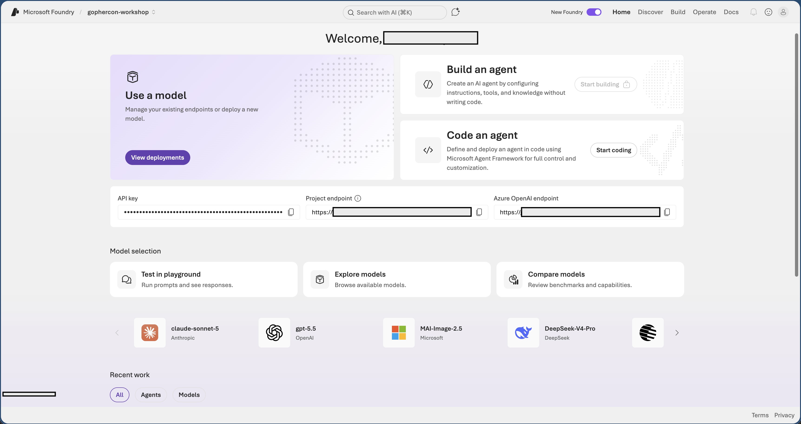

## Part 1 - Log in to Microsoft Foundry

1. Open the browser. On the lab VM, this will be the Edge browser in the bottom taskbar.
2. Navigate to `https://ai.azure.com` in the browser's address bar, if it's not already open.
3. Sign in with the details below:    
    **Username**: +++@lab.CloudPortalCredential(User1).Username+++    
    **Password (TAP)**:  +++@lab.CloudPortalCredential(User1).AccessToken+++     
4. In the top bar, toggle on the **New Foundry** switch.
5. From the project dropdown, select the only project available and click **Let's go**.

6. A dialog may pop-up that gives you a tour of the Foundry interface - feel free to click through it to get a quick overview of where things are. At the end of the tour, another dialog may pop up that suggests creating an agent. Close that dialog, as we will be creating an agent in a later step.

---

✅ **In this step you have:** signed in to Microsoft Foundry, switched on the
**New Foundry** experience, and confirmed your project is selected.

➡️ Click **Next** to find a model and try it out in the Playground.

