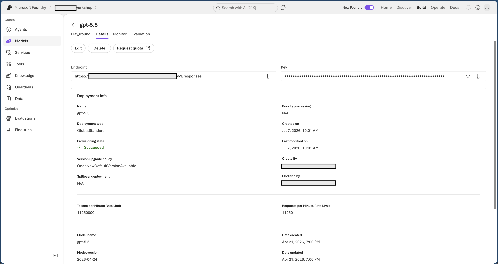

## Part 3 - Configure the Model Connection

Now that you know the model works, you need its **Target URI**, **API key**,
and **deployment name**. Agent Framework uses them through Foundry's
OpenAI-compatible model API.

An **API key** is a type of credential: a secret value the program sends to
Foundry to prove it is allowed to use the model.

1. Open the model deployment details and copy the **Target URI** and **Key**.
   The URI ends with '/openai/v1'.
2. Note the model **deployment name** (e.g. "gpt-5.5").

   

3. On the lab VM, open **Visual Studio Code** from the Start menu or the
   taskbar. It opens 'c:\agents' by default - that's where the workshop
   code lives.

4. In the VS Code Explorer, create a new file called '.env' and add the
   placeholder values:

   ```env
   FOUNDRY_ENDPOINT="https://<your-resource>.services.ai.azure.com/openai/v1"
   FOUNDRY_API_KEY="<your-api-key>"
   FOUNDRY_MODEL_DEPLOYMENT="gpt-5.5"
   ```

   Treat the API key like a password. Do not paste it into source code or chat.

---

✅ **In this step you have:** copied the **Target URI**, **API key**, and
**deployment name**, then configured '.env'.

➡️ Click **Next** to start building the agent in code.
