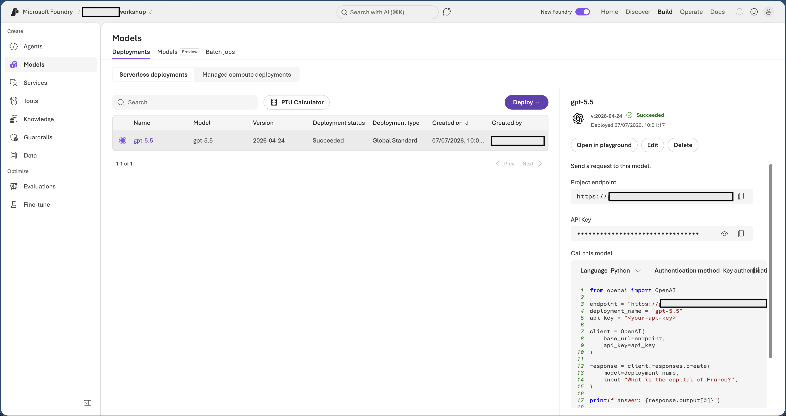
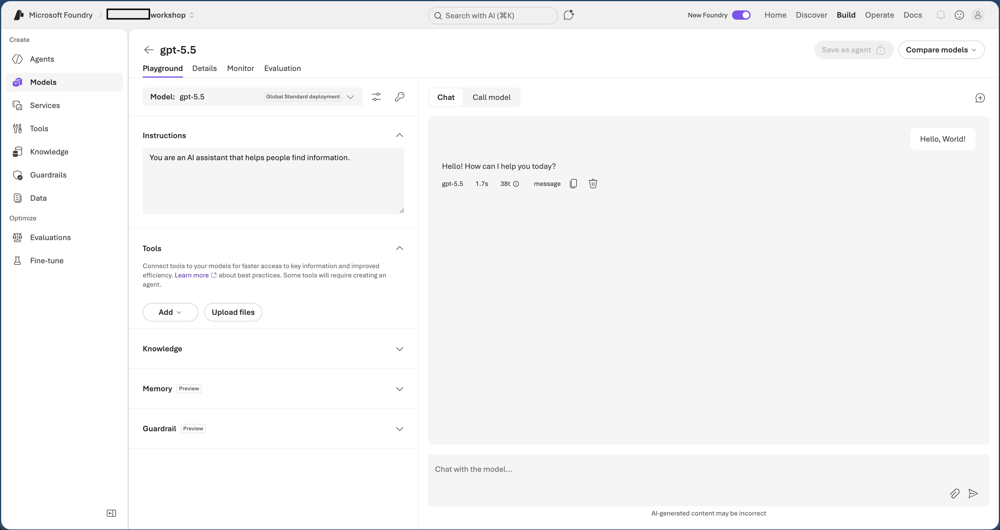

# Workshop: Build an AI Agent with Microsoft Foundry and Go

Welcome to **Sparkles**, a cupcake shop that needs an agent to greet guests,
show the day's flavors, check stock, and place orders.

You will deploy a GPT model in Microsoft Foundry, then build the agent in Go
with the public preview of
[Microsoft Agent Framework for Go](https://github.com/microsoft/agent-framework-go).
The agent will discover tools and prompts from the Cupcake Store MCP server.

By the end, you will have used three framework concepts that transfer to larger
agent applications:

- a **provider** connects an agent to a model hosted by Microsoft Foundry;
- a **session** carries conversation context across turns;
- **tools** are discovered from MCP and executed automatically by the framework.

## Prerequisites

- Access to an Azure subscription with Microsoft Foundry
- Go 1.25 or later
- Azure CLI
- This repository cloned locally or opened in the workshop environment

## Part 1 - Open Microsoft Foundry

1. Open <https://ai.azure.com> and sign in with the workshop account.
2. In the top bar, turn on **New Foundry**.
3. Confirm that the workshop project is selected.


## Part 2 - Test a Model

A **model** is the underlying AI. A **deployment** is the named instance of
that model available to your project. Your Go application uses the deployment
name.

1. Select **Build** in the top navigation.
2. Select **Models**, then open the **Deployments** tab.
3. Choose a deployed GPT model, such as `gpt-5.5`, and note its deployment
   name.
4. In the playground, send `Hello world` and verify that the model responds.



The playground is useful for trying instructions before putting them into an
agent. For example, set the instructions to `You are a pirate. Answer every
question in pirate slang.` and compare the next response.



## Part 3 - Configure the Model Connection

Agent Framework's OpenAI-compatible provider uses the model **target URI**, its
**API key**, and the **deployment name**.

1. In the model deployment details, copy the **Target URI** and **Key**. The
    target URI has this shape:

   ```text
    https://<resource>.services.ai.azure.com/openai/v1
   ```

2. Open `sparkles-agent/.env` and set all three values:

   ```env
    FOUNDRY_ENDPOINT="https://<resource>.services.ai.azure.com/openai/v1"
    FOUNDRY_API_KEY="<api-key>"
    FOUNDRY_MODEL_DEPLOYMENT="<deployment-name>"
   ```

Treat the API key like a password. Do not paste it into source code, chat, or
screenshots.

## Part 4 - Build the Agent

Open a terminal in the working folder and download the dependencies:

```bash
cd sparkles-agent
go mod download
```

The module uses:

- `agent-framework-go` for agents, sessions, the OpenAI-compatible provider, and MCP tool
  adapters;
- `openai-go` for the model endpoint and API-key client;
- `modelcontextprotocol/go-sdk` for MCP prompts and transport;
- `godotenv` to load the local `.env` file.

### Step 1 - Run a Foundry Agent

Start with an agent that can talk to the deployed model. Replace `main.go` with:

```go
// Sparkles - The Cupcake ordering agent
package main

import (
    "bufio"
    "context"
    "fmt"
    "os"
    "strings"

    "github.com/joho/godotenv"
    "github.com/microsoft/agent-framework-go/agent"
    "github.com/microsoft/agent-framework-go/provider/openaiprovider"
    "github.com/openai/openai-go/v3"
    "github.com/openai/openai-go/v3/option"
)

func main() {
    _ = godotenv.Load()
    ctx := context.Background()

    client := openai.NewClient(
        option.WithBaseURL(os.Getenv("FOUNDRY_ENDPOINT")),
        option.WithAPIKey(os.Getenv("FOUNDRY_API_KEY")),
    )

    sparkles := openaiprovider.NewAgent(
        client,
        openaiprovider.AgentConfig{
            Model: os.Getenv("FOUNDRY_MODEL_DEPLOYMENT"),
            Config: agent.Config{Name: "Sparkles"},
        },
    )
    session, err := sparkles.CreateSession(ctx)
    if err != nil {
        fmt.Fprintln(os.Stderr, "failed to create agent session:", err)
        os.Exit(1)
    }

    fmt.Println("Type 'exit' to quit.")
    scanner := bufio.NewScanner(os.Stdin)
    for {
        fmt.Print("\033[1;35mYou:\033[0m\n")
        if !scanner.Scan() {
            break
        }
        input := strings.TrimSpace(scanner.Text())
        if input == "exit" || input == "quit" {
            break
        }

        response, err := sparkles.RunText(ctx, input, agent.WithSession(session)).Collect()
        if err != nil {
            fmt.Fprintln(os.Stderr, "error:", err)
            continue
        }
        fmt.Printf("\n\033[1;35mAssistant:\033[0m\n%s\n\n", response)
    }
}
```

Run it:

```bash
go run .
```

Ask `What did I just say?` after an earlier message. Reusing the same
`agent.Session` lets the framework carry the conversation context.

### Step 2 - Add MCP Tools

The Cupcake Store publishes tools over Streamable HTTP. Agent Framework's
`mcptool` package connects to the server and adapts every discovered MCP tool
into an `agent.Tool`.

Add these imports:

```go
"github.com/microsoft/agent-framework-go/tool/mcptool"
mcpsdk "github.com/modelcontextprotocol/go-sdk/mcp"
```

Add the server URL above `main`:

```go
const cupcakeMCPURL = "https://ca-cupcake-mcp.jollyplant-ed217b0d.eastus.azurecontainerapps.io/mcp/"
```

After creating the credential, connect and discover tools:

```go
mcpSession, err := mcptool.Connect(ctx, &mcpsdk.StreamableClientTransport{
    Endpoint: cupcakeMCPURL,
})
if err != nil {
    fmt.Fprintln(os.Stderr, "failed to connect to MCP server:", err)
    os.Exit(1)
}
defer mcpSession.Close()

tools, err := mcptool.ListTools(ctx, mcpSession)
if err != nil {
    fmt.Fprintln(os.Stderr, "failed to list tools:", err)
    os.Exit(1)
}
```

Attach the tools when creating the agent:

```go
openaiprovider.AgentConfig{
    Model:        os.Getenv("FOUNDRY_MODEL_DEPLOYMENT"),
    Instructions: "Help customers choose and order cupcakes. Use the available tools.",
    Config: agent.Config{
        Name:  "Sparkles",
        Tools: tools,
    },
},
```

Run the agent again:

```bash
go run .
```

Try `What cupcake flavors are available?` and then place an order. The
framework handles the model/tool/model cycle automatically; your application
does not parse function calls or send tool results itself.

### Step 3 - Load the Persona from MCP

The server also owns Sparkles' instructions and welcome banner. Add this helper
below `main`:

```go
func promptText(ctx context.Context, session *mcpsdk.ClientSession, name string) (string, error) {
    result, err := session.GetPrompt(ctx, &mcpsdk.GetPromptParams{Name: name})
    if err != nil {
        return "", err
    }
    var text strings.Builder
    for _, msg := range result.Messages {
        if content, ok := msg.Content.(*mcpsdk.TextContent); ok {
            text.WriteString(content.Text)
        }
    }
    return text.String(), nil
}
```

After listing the tools, fetch both prompts:

```go
instructions, err := promptText(ctx, mcpSession, "agent_instructions")
if err != nil {
    fmt.Fprintln(os.Stderr, "failed to load agent_instructions prompt:", err)
    os.Exit(1)
}
banner, err := promptText(ctx, mcpSession, "welcome_banner")
if err != nil {
    fmt.Fprintln(os.Stderr, "failed to load welcome_banner prompt:", err)
    os.Exit(1)
}
```

Set `Instructions: instructions` in `openaiprovider.AgentConfig`, print the
banner before the chat loop, and optionally kick off the conversation with:

```go
response, err := sparkles.RunText(ctx, "hello", agent.WithSession(session)).Collect()
```

The completed implementation is in
[`sample-code/main.go`](sample-code/main.go).

Run it and order a cupcake:

```bash
go run .
```

## What You Built

The final request path is:

```text
You
  -> Agent Framework session
  -> Foundry model
  -> Agent Framework automatic tool execution
  -> Cupcake Store MCP server
  -> Foundry model
  -> You
```

The application still reads MCP prompts directly because prompts configure the
agent and CLI. MCP tools are given to Agent Framework, which owns their
execution loop.

## Ideas to Explore

- Stream updates by iterating over `RunText(..., agent.Stream(true))`.
- Marshal an `agent.Session` to JSON and restore it later.
- Add middleware for logging or OpenTelemetry tracing.
- Swap `FOUNDRY_MODEL_DEPLOYMENT` to compare deployments without changing agent code.
- Add approval middleware before tools that create orders.

## Troubleshooting

| Symptom | Fix |
| --- | --- |
| `FOUNDRY_API_KEY is required` | Copy the deployment key from Foundry into `.env`. |
| HTTP 401 or 403 | Verify `FOUNDRY_API_KEY` is a current key for the resource containing the deployment. |
| HTTP 404 | Use the model **Target URI** ending in `/openai/v1` for `FOUNDRY_ENDPOINT`. |
| Model deployment not found | Set `FOUNDRY_MODEL_DEPLOYMENT` to the deployment name shown in Foundry. |
| MCP connection failed | Verify that `cupcakeMCPURL` is reachable and includes the `/mcp/` path. |
| The agent answers but does not use tools | Confirm `Tools: tools` is inside `agent.Config` and ask a question that requires live store data. |

Microsoft Agent Framework for Go is in public preview, so APIs may evolve.
The workshop pins a known working SDK commit in `go.mod` for repeatable labs.
